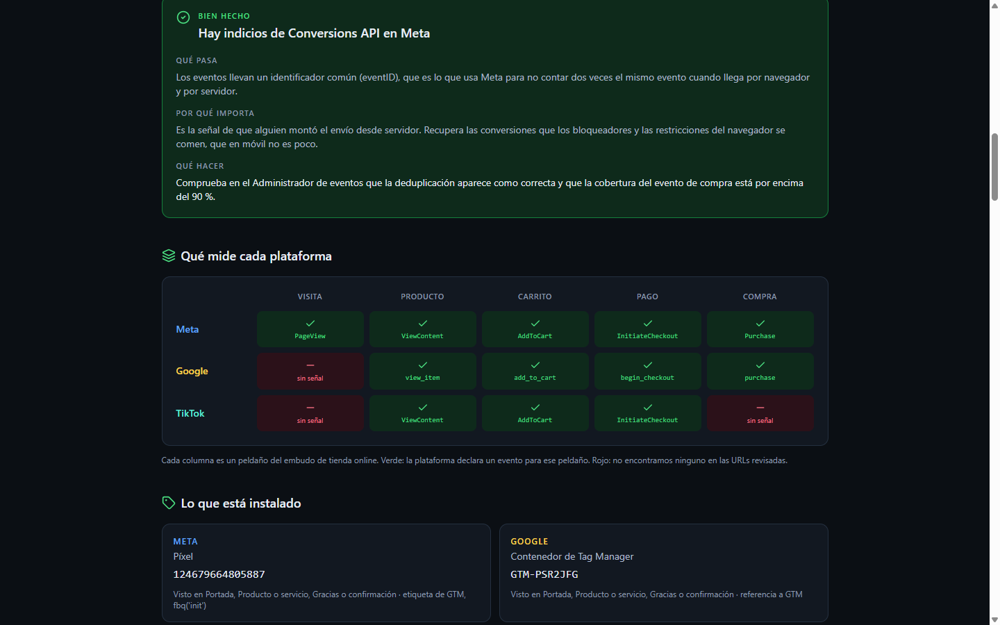
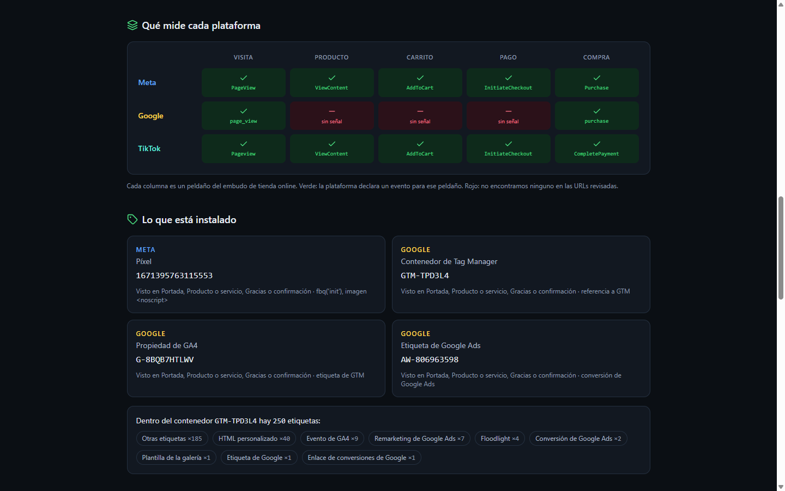

# Señal

**Auditoría de píxeles y eventos de conversión.** Pegas hasta tres direcciones de un sitio y te
dice qué está midiendo de verdad, qué está roto y qué falta, en Meta, Google, TikTok y LinkedIn.

🔗 **En vivo:** https://app11.reto.icebergmarketingdigital.com



---

## Qué hace

Descarga las páginas que le des, abre además el contenedor público de Google Tag Manager y cruza
lo que encuentra con el embudo del tipo de negocio que elijas. Devuelve un informe con nota,
hallazgos ordenados por impacto y una matriz de plataformas por peldaño del embudo.

Detecta:

- **Identificadores instalados** — píxel de Meta, propiedad de GA4, contenedor de GTM, etiquetas de
  Google Ads, píxel de TikTok, Insight Tag de LinkedIn, y restos de Universal Analytics.
- **Eventos declarados** en cada URL y dentro del contenedor de GTM.
- **Píxeles duplicados** — el mismo identificador iniciándose desde dos sitios a la vez (pegado a
  mano en la plantilla *y además* dentro de GTM). Es el hallazgo que más dinero cuesta: el disparo
  doble infla las conversiones, el coste por conversión sale a la mitad y las campañas optimizan
  con datos falsos.
- **Píxeles que solo registran visitas** — instalados y disparando PageView, sin una sola señal de
  conversión, mientras la campaña está configurada para optimizar a conversiones.
- **Cobertura desigual entre plataformas** — cada panel contando una historia distinta del mismo mes.
- **Eventos con nombre propio** donde debería haber uno estándar, que la plataforma registra pero
  no entiende y por tanto no usa para optimizar.
- **Huecos del embudo** según el negocio: tienda online, generación de leads o reservas y citas.

## Para quién

Para quien gestiona la inversión en anuncios de un negocio —agencia, freelance o responsable de
marketing— y necesita saber en un minuto si los números de sus paneles se pueden creer, sin pedir
acceso a ninguna cuenta ni instalar una extensión.

El caso típico: heredas una cuenta, el panel dice 200 conversiones, el cliente dice que vendió 100,
y nadie sabe cuál de los dos números es el bueno.

## Lo que NO puede ver, dicho de frente

Leyendo el HTML solo se ve **lo que manda el servidor**. Un evento atado a un clic o al envío de un
formulario no existe hasta que alguien hace clic, así que no aparece aquí ni cuando está bien
puesto. El informe nunca dice «no hay evento X»: dice «no lo encontramos en estas URLs», y lleva
siempre un bloque que declara qué se pudo comprobar y qué no.

Del contenedor de GTM se ven las etiquetas que contiene, pero no en qué condiciones se disparan
—una etiqueta puede estar pausada— y las que toman el nombre del evento de una variable se cuentan
aparte, sin sumar ni restar.

La nota se calcula **solo sobre las áreas que se pudieron medir**, y la pantalla dice sobre cuántos
puntos va. Una nota sin cobertura declarada no es una nota.

El detalle de cada decisión y de sus límites está en **[DECISIONES.md](DECISIONES.md)**.

## Dos auditorías reales

Ejecutadas contra la app desplegada, con tres URLs cada una: portada, ficha de producto y carrito.

### alkosto.com — **58 sobre 100**

| | |
|---|---|
| Instalado | Píxel de Meta, contenedor `GTM-PSR2JFG` con **693 etiquetas**, **cinco propiedades de Universal Analytics** y cuatro etiquetas de Google Ads |
| Matriz | Meta 5/5 · Google 4/5 · TikTok 3/5 |
| Hallazgos | TikTok mide mucho menos que Meta · 1 evento con nombre propio (`purchase_declined`) · queda código de Universal Analytics · indicios de Conversions API |

Universal Analytics dejó de recoger datos: cinco propiedades muertas siguen cargando en cada
visita. Y el desnivel entre plataformas es el problema real de fondo — TikTok no declara la compra,
así que su panel nunca podrá justificar su propia inversión.


### tennis.com.co — **82 sobre 100**

| | |
|---|---|
| Instalado | Píxel de Meta, contenedor `GTM-TPD3L4` con 250 etiquetas, propiedad de GA4 y etiqueta de Google Ads |
| Matriz | Meta 5/5 · TikTok 5/5 · Google 2/5 |
| Hallazgos | Google mide mucho menos que Meta · 1 evento con nombre propio · indicios de Conversions API |

El contraste de un sitio bien montado: **Meta y TikTok con el embudo entero**, los cinco peldaños.
El hueco está en GA4, que solo declara visita y compra, así que el análisis de dónde se cae la
gente no se puede hacer en Analytics aunque sí en los paneles de anuncios.



> Durante el desarrollo se auditó también `icebergmarketingdigital.com`, pero **quedó fuera del
> material publicado por tratarse de un sitio en construcción**: sus resultados no representan una
> instalación terminada y no serían una muestra justa de la herramienta.

## Capturas

En [`capturas/`](capturas) están las tres del cierre (escritorio, móvil y la app en uso) y en
[`capturas/post/`](capturas/post) las nueve preparadas para publicación.

## Stack

| Pieza | Qué |
|---|---|
| Frontend | Vite + React 18 + TypeScript + Tailwind, `lucide-react`, `lz-string` |
| Backend | Node 22, **cero dependencias** (`http`, `https`, `dns`, `net`, `zlib` de la librería estándar) |
| Persistencia | Ninguna. El informe compartible viaja comprimido dentro de la URL |
| Detección | Determinista, sin modelos de lenguaje |
| Despliegue | Estático detrás de nginx; la API, un contenedor `node:22-alpine` con un solo archivo montado |
| Límite | 5 análisis por hora y por IP |

## Desarrollo

```bash
npm install
npm run api      # API en el 3011
npm run dev      # frontend, con proxy de /api al 3011
```

### Pruebas

```bash
node herramientas/probar-motor.mjs    # detección, sin red ni navegador
node herramientas/generar-demo.mjs    # regenera el informe de ejemplo
```

El informe de ejemplo que la app enseña al abrirse **pasa por el motor real**: el generador
sustituye la descarga por un lector de ficheros y audita las páginas de `herramientas/ejemplo/`.
No hay ningún informe escrito a mano.

`herramientas/probar-ssrf.mjs` es la batería de destinos prohibidos. Se ejecuta **dentro de la red
del servidor**, nunca desde la máquina de desarrollo: los vectores que importan son dominios
públicos cuyo DNS resuelve a una IP privada, y en local esos nombres no resuelven, así que la
prueba saldría verde por el motivo equivocado.

## Seguridad

La API descarga direcciones que escribe cualquiera. El guardián de destino resuelve el DNS a mano,
descarta las direcciones privadas, **le pasa a la conexión la IP ya validada** para que no haya
ventana entre comprobar y conectar, revalida cada redirección, juzga aparte las IP literales
—cuando el host ya es una IP, node no llama al resolutor— y solo permite los puertos 80 y 443.

Esa última regla la puso la batería de ataques, no la lectura del código: 16 de 17 vectores caían,
y el que pasaba era el panel de administración del propio servidor en su IP pública. Cerrar por
puerto mata la clase entera en vez de tapar el caso.
